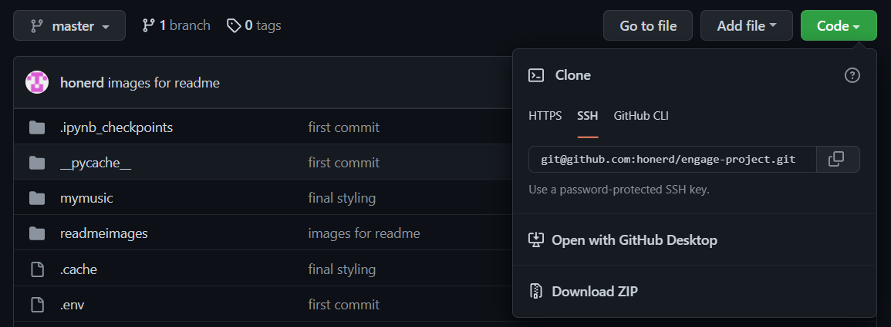
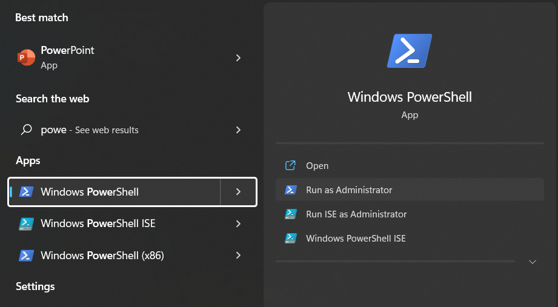
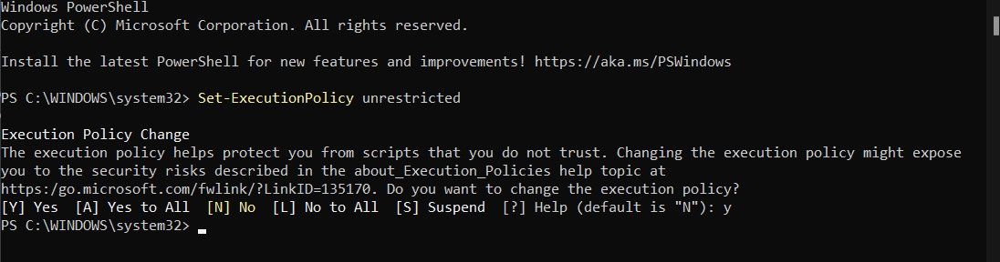
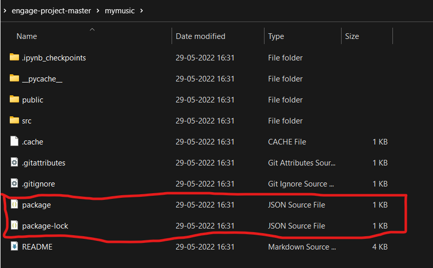
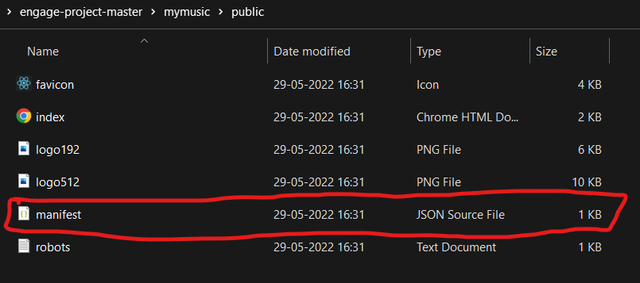
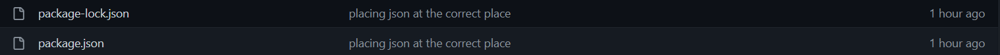
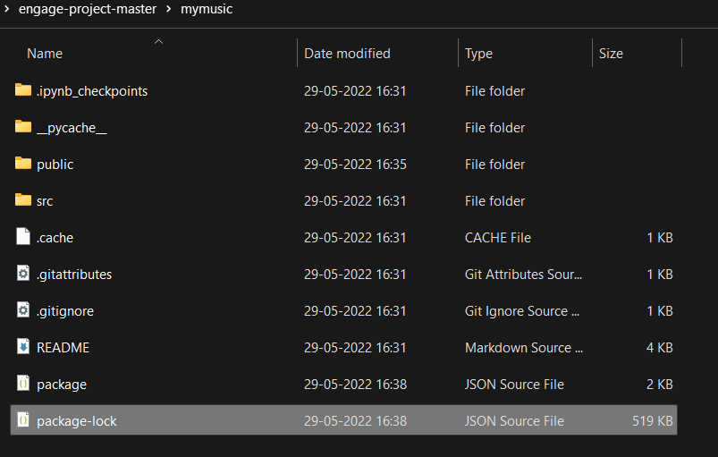
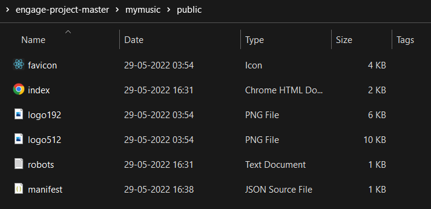

# MyMusic App

## Description

This project involves the use of TF-IDF vectoriser in python to create recommendations based on your favourite songs and Then uses Spotipy to integrate users. For the purpose of this project this accesses my playlists and recent songs

 

## Tech-Stack Used

 1. Frontend: ReactJS
 2. Backend: Python Flask
 3. Machine Learning Algorithm Used: Scikit-learn TF-IDF vectoriser
 4. Language Used for ML: Python
 
# Setting the Project Up
 
## STEP 1: Downloading the Repository

Download the Repositry from the github page
 

 
 

## STEP 2: Setting up the Set Execution policy before creating the virtual environment

Open the powershell with admin access 
 

 

Execute the following Set-ExecutionPolicy unrestricted command and then answer Y to configure
 
 
 

## STEP 3: Configuring the files

Delete the package.json and package-lock.json from the mymusic folder and manifest.json from the ppublic folder
 

 
 

 
 

Download package.json, package-lock.json and manifest.json 
 

 
 
manifest.json is in public directory
 
 

 
 

Replacing the previously deleted files with the newly downloaded ones
 

 
 

